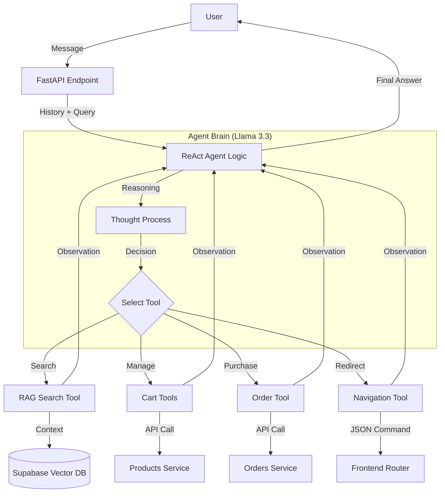

# Chatbot Service - UCB Commerce

An intelligent **ReAct (Reasoning and Acting) Agent** that orchestrates tools to assist users with product discovery, cart management, and order placement.

## The Problem
Standard chatbots are passive; they can answer questions but cannot *do* anything. Users want to say "Buy the UCB Hoodie" and have it happen. We needed a system that could **reason** about user intent, **plan** a sequence of actions, and **execute** them using backend APIs.

## Architecture: ReAct Agent
We moved from a simple RAG system to a **ReAct Agent** architecture. The LLM acts as a central brain that has access to a suite of tools. It thinks, acts, observes the result, and thinks again until the task is complete.



## Capabilities & Tools

The agent is equipped with the following tools:

1.  **`rag_search_tool`**: Retrieves product details and institutional info using semantic search (Supabase pgvector).
2.  **`add_to_cart_tool`**: Adds items to the user's cart via the Products Service. *Includes validation for product IDs.*
3.  **`remove_from_cart_tool`**: Removes specific items from the cart.
4.  **`clear_cart_tool`**: Empties the entire cart.
5.  **`create_order_tool`**: Generates a new order based on current cart contents via the Orders Service.
6.  **`navigate_tool`**: Instructs the frontend to redirect the user to a specific product page.

## Key Features

-   **Memory & Persistence**: The agent remembers conversation context across turns (stored in frontend `localStorage` and passed to backend).
-   **Proactive Persona**: The agent actively offers to perform actions (e.g., "Shall I add this to your cart?") rather than just providing information.
-   **Auto-Navigation**: Automatically redirects users to product pages when requested.
-   **Robust Error Handling**: Gracefully handles API errors and retries logic to prevent loops.
-   **Direct Purchase Logic**: Intelligently chains `Add to Cart` -> `Create Order` when a user requests a direct purchase.

## Tech Stack

-   **Language**: Python 3.10+
-   **Framework**: FastAPI
-   **LLM**: Llama 3.3-70b-versatile via Groq
-   **Vector DB**: Supabase (PostgreSQL + pgvector)
-   **Embeddings**: OpenAI text-embedding-3-small
-   **Orchestration**: Custom ReAct Loop

## Setup & Run

1.  **Install dependencies:**
    ```bash
    pip install -r requirements.txt
    ```

2.  **Configure Environment Variables:**
    Ensure `.env` contains keys for OpenAI, Groq, Supabase, and URLs for `PRODUCTS_API_URL` and `ORDERS_API_URL`.

3.  **Run Server:**
    ```bash
    uvicorn app.main:app --reload --port 8002
    ```