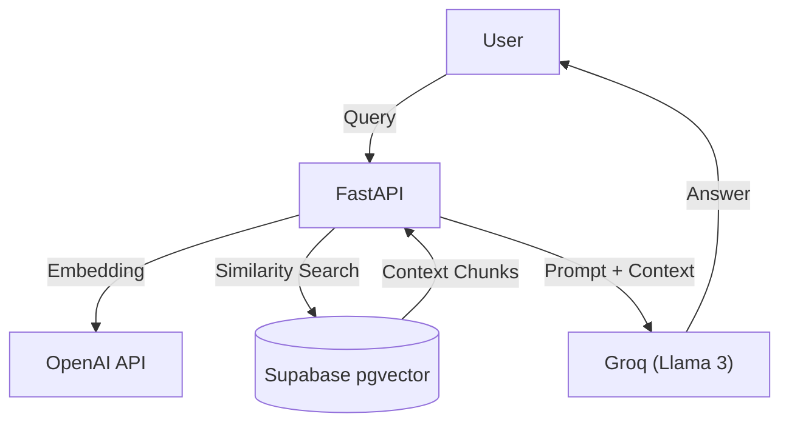

# Chatbot Service - UCB Commerce

An intelligent conversational agent powered by **RAG (Retrieval-Augmented Generation)** to assist users with product inquiries and institutional information.

## The Problem
Standard e-commerce search bars are limited. Users often have complex questions like "What's the best laptop for an architecture student under $1000?" or "Do you have the biology textbook in stock?". A keyword search fails here. We needed a system that understands **intent** and **context**.

## Architecture


## Technical Decisions

### Why Supabase (pgvector) over Pinecone/Weaviate?
We chose **Supabase with pgvector** to keep our vector embeddings alongside our relational data (if needed) in a Postgres environment.
- **SQL + Vectors**: It allows us to perform hybrid searches (e.g., "Find products similar to X BUT only in category Y") using standard SQL queries.
- **Simplicity**: No need to manage a separate specialized vector database infrastructure.

### Why RAG?
We didn't just want a chatbot that "chats"; we wanted one that "knows". **RAG** allows us to inject real-time data (product prices, stock) into the LLM's context window. This solves the "hallucination" problem where AI models invent facts. Our bot cites its sources.

### Why Groq?
We utilize **Groq** for LLM inference because of its unparalleled speed (LPU architecture). For a chatbot, latency is the killer of user experience. Groq delivers near-instant responses, making the conversation feel natural.

## Features
- **Semantic Search**: Understands meaning, not just keywords.
- **Real-time Inventory Awareness**: Knows if a product is out of stock.
- **Hybrid Knowledge**: Combines product data with static institutional info (policies, hours).

## Tech Stack
- **Language**: Python 3.10+
- **Framework**: FastAPI
- **Vector DB**: Supabase (PostgreSQL + pgvector)
- **LLM**: Llama 3 via Groq
- **Embeddings**: OpenAI text-embedding-3-small

## Setup & Run

1.  **Install dependencies:**
    ```bash
    pip install -r requirements.txt
    ```

2.  **Configure Environment Variables:**
    Set up `.env` with OpenAI, Groq, and Supabase keys.

3.  **Run Server:**
    ```bash
    uvicorn app.main:app --reload --port 8004
    ```